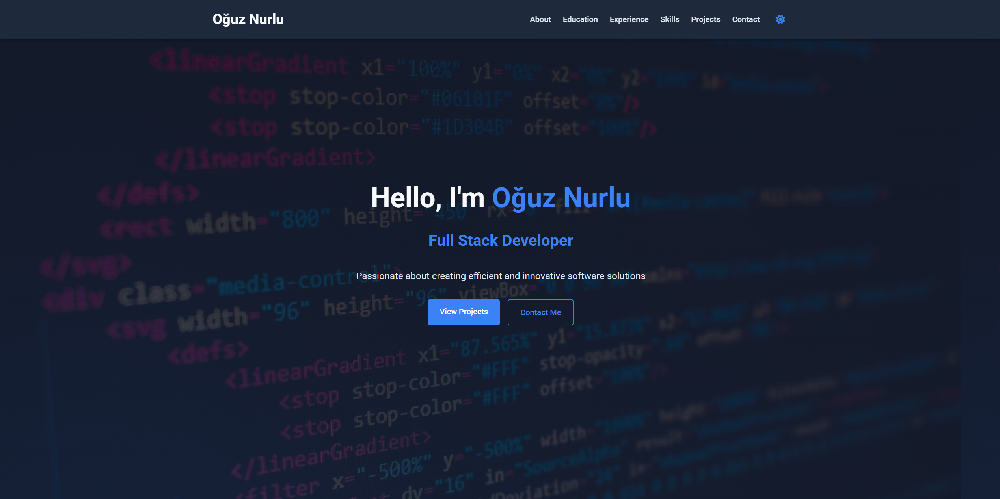

# Oğuz Nurlu - Portfolio Website

A fully responsive personal portfolio website built with HTML, CSS, and JavaScript.

## 🌐 Live Demo

Check out the live demo of my portfolio website at [https://thnorty.github.io/Portfolio/](https://thnorty.github.io/Portfolio/)

## 🚀 Features

- Responsive design for all device sizes
- Dark/light mode toggle with local storage persistence
- Smooth scrolling navigation
- Animated sections using Intersection Observer
- Typing animation in hero section
- Mobile-friendly navigation menu

## 💻 Technologies

- HTML5
- CSS3 (with CSS variables for theming)
- Vanilla JavaScript
- Font Awesome icons
- Google Fonts (Roboto)
- Intersection Observer API

## 📋 Sections

- Hero
- About Me
- Education
- Work Experience
- Skills & Languages
- Projects
- Hobbies & Interests
- Contact

## 🔧 Installation & Setup

1. Clone the repository:

   ```bash
   git clone https://github.com/yourusername/portfolio.git
   ```

2. Navigate to the project directory:

   ```bash
   cd portfolio
   ```

3. Open `index.html` in your browser or use a local server:

   ```bash
   # Using Python's built-in server
   python -m http.server
   ```

## 📝 License

This project is open source and available under the [MIT License](LICENSE).

## 📱 Contact

Feel free to reach out to me:

- Email: [nurluoguz03@gmail.com](mailto:nurluoguz03@gmail.com)
- LinkedIn: [linkedin.com/in/oguz-nurlu](https://linkedin.com/in/oguz-nurlu)
- GitHub: [github.com/Thnorty](https://github.com/Thnorty)

## 🔍 Preview


